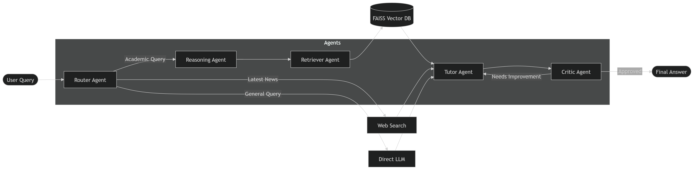
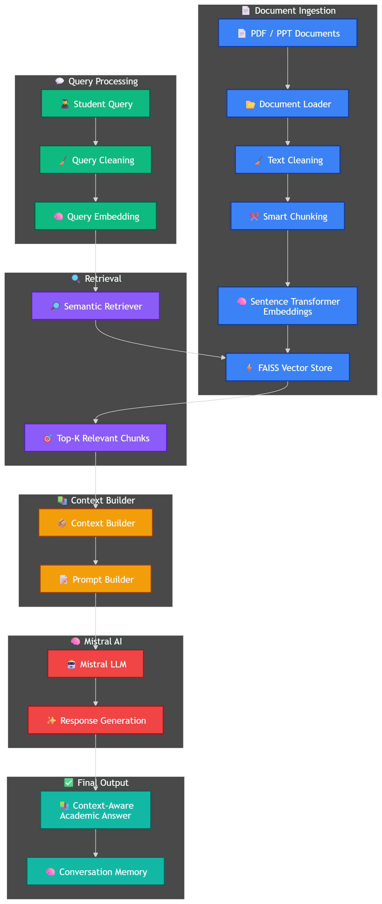
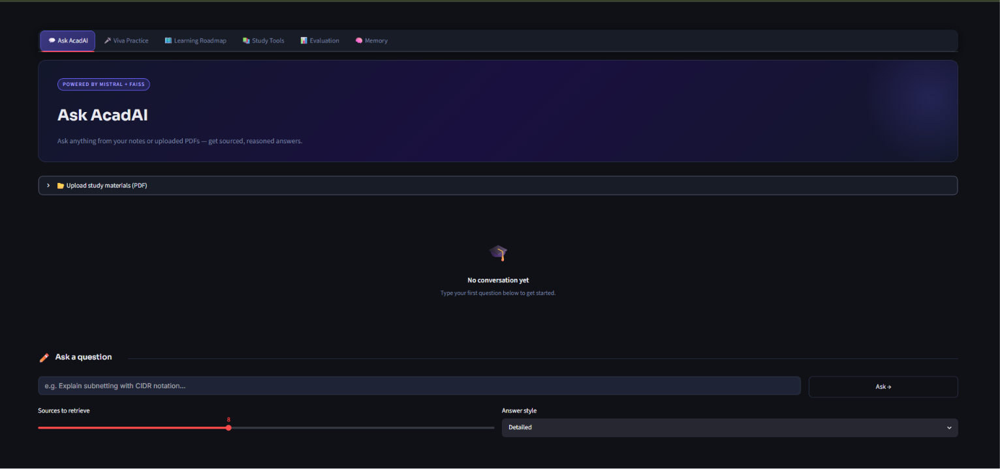
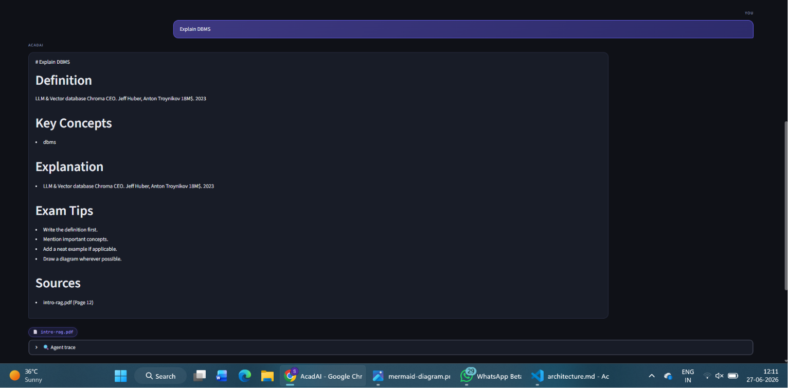
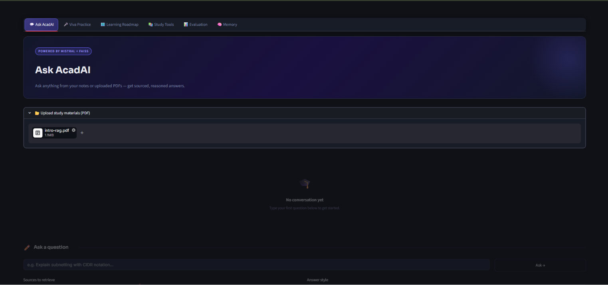
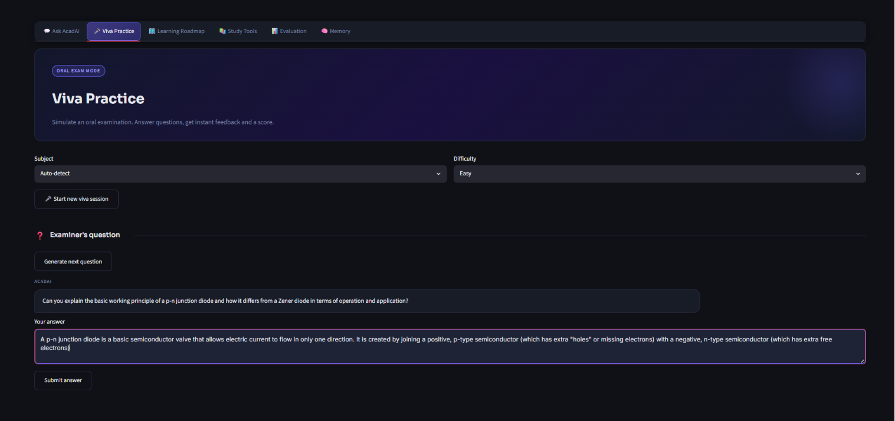
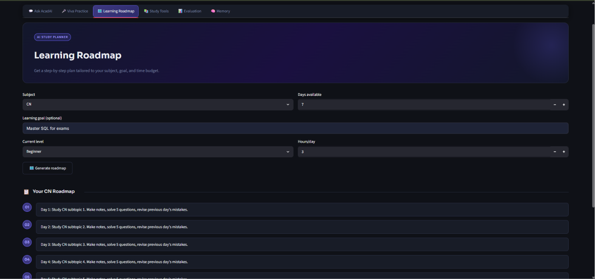
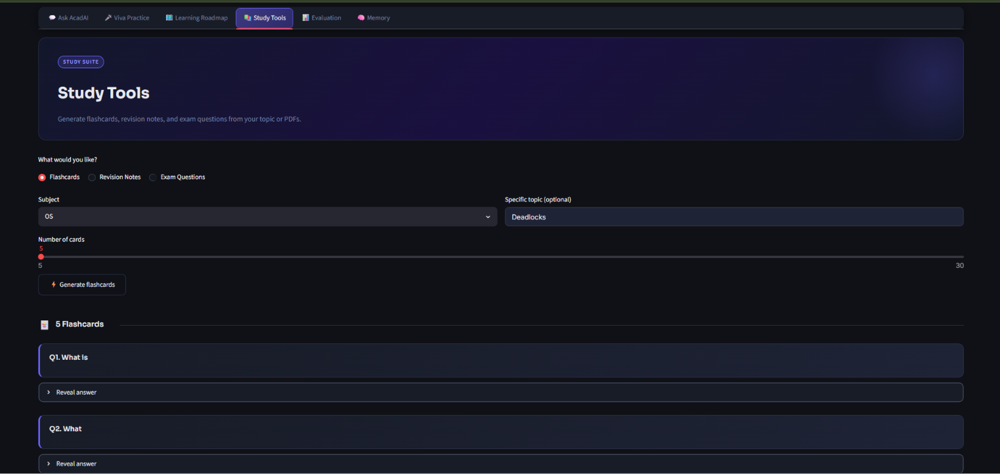
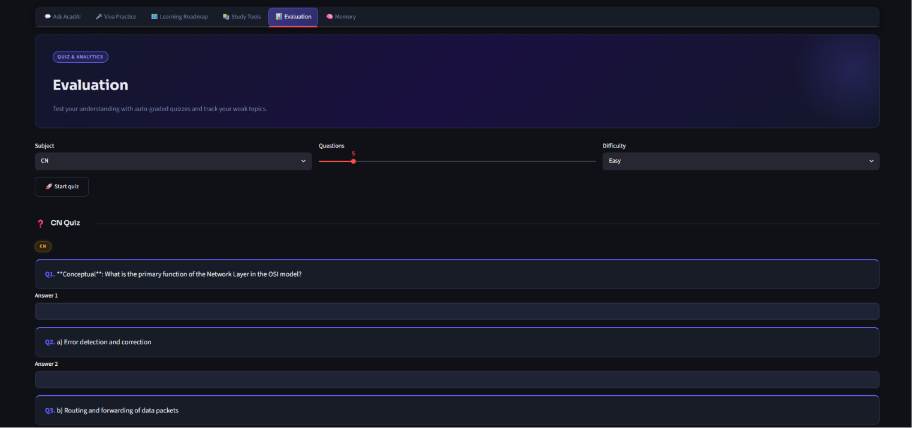
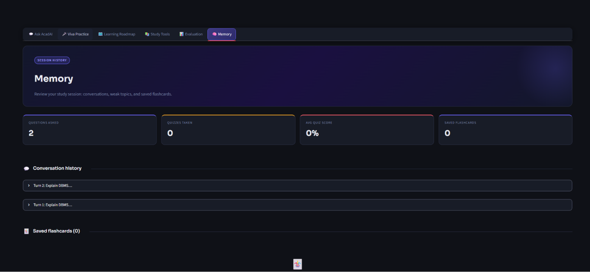

<div align="center">

# 🎓 AcadAI

### AI-Powered RAG Academic Learning Assistant

*An intelligent academic assistant that leverages Retrieval-Augmented Generation (RAG), semantic search, and Mistral AI to deliver accurate, context-aware learning support from academic documents.*

<br>


</div>

---

# 🌟 Overview

AcadAI is an **AI-powered Academic Learning Assistant** designed to enhance the learning experience through **Retrieval-Augmented Generation (RAG)** and **semantic document retrieval**.

Instead of relying solely on the knowledge of a language model, AcadAI retrieves relevant information from uploaded academic documents using **Sentence Transformer embeddings** and **FAISS vector search**, allowing it to generate accurate, context-aware responses grounded in institutional learning materials.

The application provides dedicated learning modules for academic question answering, viva preparation, personalized learning roadmaps, study tools, evaluation, and conversation memory through an intuitive Streamlit interface.

---

# 🚀 Key Highlights

- 📚 Retrieval-Augmented Generation (RAG)
- 🔍 Semantic Search using FAISS Vector Database
- 🧠 Sentence Transformer Embeddings
- 🤖 Mistral AI Integration
- 📄 PDF & PPT Knowledge Base
- 💬 Context-Aware Academic Question Answering
- 🎤 Interactive Viva Practice
- 🗺️ Personalized Learning Roadmaps
- 📚 Smart Study Tools
- 📊 Learning Evaluation Module
- 🧠 Conversation Memory
- ⚡ Modular & Scalable Architecture

---

# ✨ Features

| Feature | Description |
|----------|-------------|
| 💬 Academic Question Answering | Ask questions from uploaded academic documents using RAG |
| 🎤 Viva Practice | Practice viva questions with AI-generated responses |
| 🗺️ Learning Roadmap | Generate personalized learning plans |
| 📚 Study Tools | Access AI-powered study assistance and learning resources |
| 📊 Evaluation | Analyze learning progress and performance |
| 🧠 Conversation Memory | Maintain contextual conversations during a session |
| 📄 Document Processing | Supports PDF and PowerPoint documents |
| 🔍 Semantic Search | Retrieves relevant content using FAISS vector search |

---

# 🏗️ System Architecture

> **High-Level Architecture**

<p align="center">


</p>

---

# 🤖 Multi-Agent Workflow

> **AcadAI Processing Workflow**

<p align="center">



</p>

---

# 📚 Retrieval-Augmented Generation (RAG) Pipeline

> **Academic Document Retrieval Pipeline**

<p align="center">



</p>

---

# ⚙️ Technology Stack

## Frontend

- Streamlit

## Backend

- Python

## Artificial Intelligence

- Mistral AI

## Retrieval-Augmented Generation (RAG)

- FAISS Vector Database
- Sentence Transformers

## Document Processing

- PyPDF
- python-pptx

## Machine Learning & NLP

- scikit-learn
- NumPy
- Pandas

## Utilities

- python-dotenv
- Requests
- BeautifulSoup4
- tqdm

---

# 📂 Project Structure

```text
AcadAI/
│
├── app.py
├── main.py
├── build_kb.py
├── config.py
├── utils.py
├── requirements.txt
├── pyproject.toml
├── README.md
│
├── agents/
├── ingestion/
├── knowledge_base/
├── llm/
├── memory/
├── models/
├── retrieval/
├── tools/
├── ui/
│
├── assets/
│   ├── logo.png
│   ├── system_architecture.png
│   ├── rag_pipeline.png
│   ├── multi_agent_workflow.png
│   └── screenshots/
│       ├── Home.png
│       ├── Query.png
│       ├── Pdf_Upload.png
│       ├── Viva_Practice.png
│       ├── Learning_Roadmap.png
│       ├── Study_Tools.png
│       ├── Evaluation.png
│       ├── History.png
│       └── architecture.png
│
├── documents/
└── uploads/
```

---

# 🚀 Getting Started

## 1️⃣ Clone the Repository

```bash
git clone https://github.com/Shashwat-web/Acad-AI.git
```

```bash
cd Acad-AI
```

---

## 2️⃣ Create a Virtual Environment

### Windows

```bash
python -m venv .venv
```

```bash
.venv\Scripts\activate
```

### Linux / macOS

```bash
python3 -m venv .venv
```

```bash
source .venv/bin/activate
```

---

## 3️⃣ Install Dependencies

```bash
pip install -r requirements.txt
```

---

## 4️⃣ Configure Environment Variables

Create a file named

```text
.env
```

Example

```env
MISTRAL_API_KEY=your_api_key

EMBEDDING_MODEL=sentence-transformers/all-MiniLM-L6-v2
```

---

## 5️⃣ Build the Knowledge Base

```bash
python build_kb.py
```

---

## 6️⃣ Run AcadAI

```bash
streamlit run app.py
```

The application will be available at

```text
http://localhost:8501
```

---

# 💻 Using AcadAI

### 💬 Ask AcadAI

Ask academic questions directly from uploaded documents.

```
Explain Operating System Scheduling Algorithms.
```

---

### 🎤 Viva Practice

Practice interview and viva questions interactively.

```
Conduct a viva on Machine Learning.
```

---

### 🗺️ Learning Roadmap

Generate personalized learning schedules.

```
Create a 10-day roadmap for Data Structures.
```

---

### 📚 Study Tools

Use AI-powered study assistance for revision and concept understanding.

---

### 📊 Evaluation

Analyze your performance and identify weak topics.

---

### 🧠 Memory

Continue conversations while preserving previous context during the session.

---

# 📸 Application Screenshots

## 🏠 Home

<p align="center">

</p>

---

## 💬 Academic Query

<p align="center">

</p>

---

## 📄 PDF Upload

<p align="center">

</p>

---

## 🎤 Viva Practice

<p align="center">

</p>

---

## 🗺️ Learning Roadmap

<p align="center">

</p>

---

## 📚 Study Tools

<p align="center">

</p>

---

## 📊 Evaluation

<p align="center">

</p>

---

## 🧠 Conversation Memory

<p align="center">

</p>

---

# 🔄 System Workflow

```text
                     Student
                         │
                         ▼
              Streamlit Web Interface
                         │
                         ▼
                 User Query Processing
                         │
                         ▼
               Query Embedding Generation
                         │
                         ▼
               Semantic Retrieval (FAISS)
                         │
                         ▼
             Top Relevant Knowledge Chunks
                         │
                         ▼
                 Context & Prompt Builder
                         │
                         ▼
                    Mistral AI
                         │
                         ▼
             Context-Aware AI Response
                         │
                         ▼
                Conversation Memory
                         │
                         ▼
                      Student
```

---

# 📈 Performance & Capabilities

| Capability | Status |
|------------|:------:|
| Retrieval-Augmented Generation (RAG) | ✅ |
| Semantic Search | ✅ |
| FAISS Vector Retrieval | ✅ |
| Mistral AI Integration | ✅ |
| Sentence Transformer Embeddings | ✅ |
| PDF Knowledge Base | ✅ |
| PowerPoint Knowledge Base | ✅ |
| Conversation Memory | ✅ |
| Viva Practice | ✅ |
| Learning Roadmap | ✅ |
| Study Tools | ✅ |
| Learning Evaluation | ✅ |
| Context-Aware Responses | ✅ |

---

# 🛣️ Roadmap

## ✅ Current Features

- Retrieval-Augmented Generation (RAG)
- Semantic Document Search
- Academic Question Answering
- Interactive Viva Practice
- Personalized Learning Roadmaps
- AI-powered Study Tools
- Learning Evaluation
- Conversation Memory
- PDF & PPT Knowledge Base

---

## 🚀 Future Enhancements

- Voice-enabled Academic Assistant
- OCR Support for Scanned Documents
- Hybrid Retrieval Techniques
- Personalized Learning Analytics
- Multi-language Support
- LMS Integration
- Mobile Application
- Cloud Deployment
- Adaptive Learning Recommendations

---

# 🧪 Technologies Used

| Category | Technologies |
|----------|--------------|
| Programming Language | Python |
| Frontend | Streamlit |
| Large Language Model | Mistral AI |
| Retrieval | FAISS |
| Embeddings | Sentence Transformers |
| Machine Learning | scikit-learn |
| Document Processing | PyPDF, python-pptx |
| Data Processing | NumPy, Pandas |
| Utilities | Requests, BeautifulSoup4, tqdm |
| Version Control | Git, GitHub |

---

# 🤝 Contributing

Contributions are welcome!

If you'd like to improve AcadAI:

1. Fork the repository.
2. Create a new feature branch.

```bash
git checkout -b feature/your-feature
```

3. Commit your changes.

```bash
git commit -m "Add new feature"
```

4. Push your branch.

```bash
git push origin feature/your-feature
```

5. Open a Pull Request.

---

# 🔮 Future Research Directions

AcadAI can be extended with:

- Adaptive Learning Systems
- Intelligent Course Recommendation
- Multi-modal Learning (Text + Images + Audio)
- AI Tutor with Personalized Feedback
- Collaborative Learning Environment
- Knowledge Graph Integration
- Automated Assignment Assistance
- Research Paper Understanding

---

# 📜 License

This project is licensed under the **MIT License**.

See the `LICENSE` file for more details.

---

# 🙏 Acknowledgements

AcadAI is built using the following open-source technologies:

- Mistral AI
- FAISS
- Sentence Transformers
- Streamlit
- PyPDF
- python-pptx
- scikit-learn
- NumPy
- Pandas

Special thanks to the open-source AI community for providing the tools and libraries that made this project possible.

---

# 👨‍💻 Author

<div align="center">

## **Shashwat Tiwari**

**B.Tech Computer Science Engineering**

Pranveer Singh Institute of Technology (PSIT), Kanpur

**Interests:** Generative AI • RAG • NLP • Machine Learning • AI Applications

</div>

---

<div align="center">

## ⭐ Support the Project

If you found **AcadAI** helpful:

⭐ Star this repository

🍴 Fork the project

🐞 Report issues

🤝 Contribute improvements

Your support helps improve the project and motivates future development.

</div>

---

<div align="center">

### 🎓 Built with ❤️ to make academic learning smarter through Artificial Intelligence.

</div>
