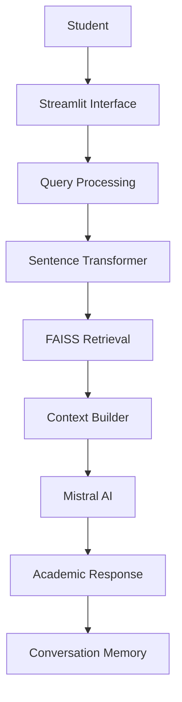
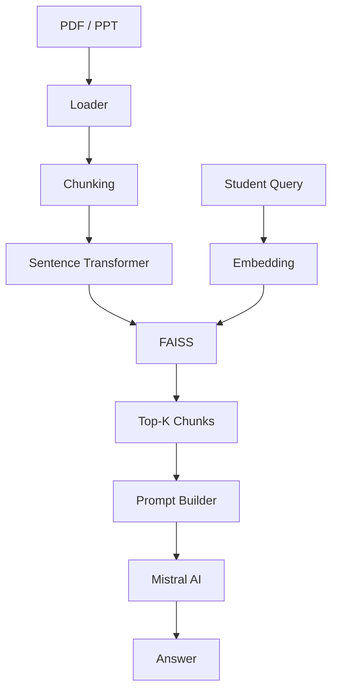

# 🏗️ AcadAI System Architecture

This document describes the overall architecture and workflow of the AcadAI project.

---

# 1. High-Level Architecture

AcadAI is an AI-powered academic learning assistant that combines semantic document retrieval with a large language model to generate context-aware academic responses.

Main components:

- Streamlit User Interface
- Document Processing Pipeline
- RAG Retrieval Engine
- FAISS Vector Store
- Mistral AI
- Conversation Memory



---

# 2. Retrieval-Augmented Generation (RAG)

The RAG pipeline consists of the following stages:

1. Document Loading
2. Text Cleaning
3. Chunking
4. Embedding Generation
5. FAISS Indexing
6. Semantic Retrieval
7. Prompt Construction
8. Response Generation



---

# 3. Application Workflow

```text
Student
    │
    ▼
Streamlit Interface
    │
    ▼
Question Processing
    │
    ▼
FAISS Semantic Retrieval
    │
    ▼
Relevant Context
    │
    ▼
Mistral AI
    │
    ▼
Context-Aware Response
```

---

# 4. Folder Structure

```text
app.py
ui/
agents/
retrieval/
memory/
knowledge_base/
documents/
assets/
```

---

# 5. Technologies

- Python
- Streamlit
- Mistral AI
- FAISS
- Sentence Transformers
- PyPDF
- python-pptx
- scikit-learn

---

# 6. Future Enhancements

- OCR Support
- Hybrid Retrieval
- Voice Interaction
- Cloud Vector Database
- Learning Analytics